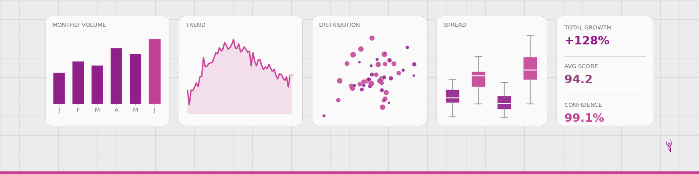

<picture>
  <source media="(prefers-color-scheme: dark)" srcset="banner-dark.png">
    <source media="(prefers-color-scheme: light)" srcset="banner-light.png">
    
</picture>

# Hi, I'm RoShawn Frazier 👋

**Data Analyst | Army Veteran | Defense & Enterprise IT Professional**

I'm a data analyst with a Master's in Data Administration & Management and 10+ years of enterprise IT experience in the defense contracting sector. I bring analytical rigor, technical depth, and the discipline that comes from military service to every project I work on.

---

## 🛠️ Tools & Skills

- **Languages:** Python, SQL
- **Visualization:** Tableau, Excel (Pivot Tables, VLOOKUP)
- **Platforms:** ServiceNow, JIRA, MS Project, Remedy
- **Competencies:** Data Cleaning & Validation, Root Cause Analysis, Requirements Analysis, UAT/QA Testing, Trend Reporting

---

## 📚 Currently Working On

- 🐍 Python Programming — VetsinTech
- 📊 IBM Data Science Professional Certificate — Coursera

---

## 🎖️ Background

- U.S. Army Veteran — HHC COSCOM
- 10 years at L3Harris Technologies (defense contracting)
- MS, Data Administration & Management — Keller Graduate School of Management
- BS, Management of Technology — DeVry University

---

## 📫 Connect With Me

- 💼 [LinkedIn](https://www.linkedin.com/in/roshawn-frazier)
- 📧 ms_frazier18@outlook.com
- 
